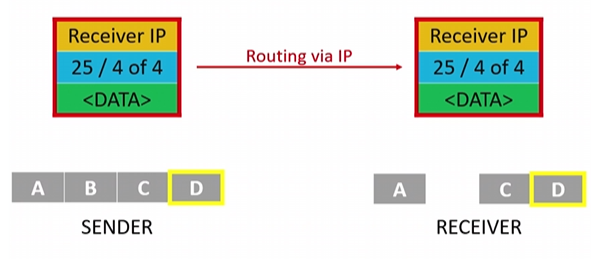
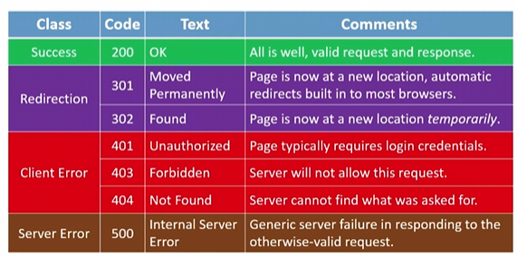
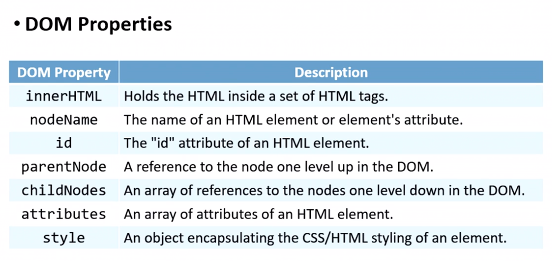
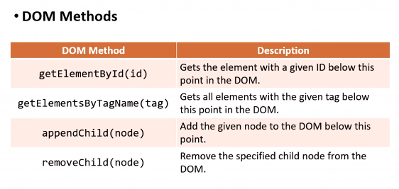

# Web Development

## Learning

### Internet

* IP stands for Internet Protocol, the unique identification address of your devices.
  * IPv4 (32bit) - format: #.#.#.# | example: 8.8.8.8
    * `#` is number from 0 to 255
  * IPv6 (128bit) - format: #:#:#:#:#:#:#:# | example: 2001:0db8:85a3:0000:0000:8a2e:0370:7334 
    * `#` hexadecimal - from 0000 to ffff
  * IP splits data into packets.
* DHCP stands for Dynamic Host Configuration Protocol
* TCP stands for Transmission Control Protocol, you can think of a port number when talking about this one. **where** the receiver is and **what** the packet is for, then it makes TCP/IP an inseparable pair. It guarantees delivery.

   
  * 80 => HTTP stands for Hypertext Transfer Protocol
  * 443 => HTTPS stands for Hypertext Transfer Protocol Security
  * 53 => DNS
  * 25 => SMTP stands for Simple Mail Transfer Protocol
  * 21 => FTP stands for File Transfer
* DDS stands for Data Distribution Service
* RDP stands for Remote Desktop Protocol
* XMPP stands for Extensible Message and Presence Protocol
* DNS stands for Domain Name System, which collects servers (hosts) and domains. It translates the IP addresses to the fully qualified domain name (with `www`). Decentralize. One domain can link to many servers.
* Access Points make you think of a router, a modem or a switch. The IP address is assigned to the router. Your devices connect to the router using private IP addresses. The router connects to the internet using the assigned IP address (public IP address).
* HTTP is one such example of an  application layer protocol.

   

   Example usage of HTTP requests and responses

   ```yaml
   # request
   GET / HTTP/1.1
   Host: www.example.com
   ...

   GET /search?q=cats HTTP/1.1
   Host: www.google.com
   ...

   # response 200 / class:Success / text:OK
   HTTP/1.1 200 OK
   Content-type: text/html
   ...

   # response 301 / class:Ridirection / text:Moved Permanently
   HTTP/1.1 301 Moved Permanently
   Content-type: text/html
   ...

   # response 404 / class:Client Error / text:Not Found
   HTTP/1.1 404 Not Found
   Content-type: text/html
   ...
   ```

### HTML

HTML stands for ...

```html
<!DOCTYPE html>
<html lang="en">
<head>
 <title>hello, title</title>
</head>
<body>
 <header></header>
 <main></main>
 <footer></footer>
<body>
</html>
```

### CSS

CSS stands for ...

```css
*{
 margin: 0;
 padding: 0;
 box-sizing: border-box;
 border: none;
 outline: none;
 text-decoration: none;
 list-style: none;
 font-family: system-ui, sans-serif;
}
html{
 line-height: 1.4;
 scroll-behavior: smooth;
}
body{
 line-height: 1.5;
 overflow-x: hidden;
}
```

#### Viewport

The viewport meta tag is an HTML tag controls how your webpage is displayed on different devices. It can be used to set the width, height, initial scale, maximum scale, and user-scalable properties of the viewport.

You can learn more about view port meta tag at:

* [MDN](https://developer.mozilla.org/en-US/docs/Web/HTML/Viewport_meta_tag)
* [W3SCHOOL](https://www.w3schools.com/css/css_rwd_viewport.asp)

Example usage of a viewport meta tag in a `*.html` file

```html
<!--This tag tells the browser to set the viewport width to the device width and the initial zoom level to 1.0-->
<meta name="viewport" content="width=device-width, initial-scale=1.0">
```

#### Media query (@media)

Media query is used for ...

A breakpoint is a spot where the website will be changed to make responsive UI. There are some common breakpoints such as PC, tablet, and mobile.

```
media-type    ::= screen => for the content that is on the screen of your devices
              ::= print => for the content that is printed
              ::= speech
              ::= all [default]
media-feature ::= max-width => apply when device's width <= defined value
              ::= min-width => apply when device's width >= defined value
```

Example usage of media query in a `*.css` file

```css
@media not|only media-type and (media-feature and|or|not media-feature)
{
  /* CSS Code */
}
```

For each `media-type` and `media-feature` you can create a separated CSS file then link to your HTML file. However, it's not suggested if you want to optimize your website performance.

Example usage of `media-type` and `media-feature` in a `*.html` file

```html
<link rel="stylesheet" media="print" href="">
<link rel="stylesheet" media="screen" href="">
<link rel="stylesheet" media="(min-width: 1024px)" href="">
<link rel="stylesheet" media="(max-width: 740px)" href="">
```

#### Polyfill

This is used for the old-fashion browsers. Search the keywords `respond.js polyfill cdn` to learn more.

Condition comment is used for defining the block of HTML code only uses for certain browsers. You can learn more about condition comment on [WikiPedia](https://en.wikipedia.org/wiki/Conditional_comment). Below is the example usage of a condition comment in a `*.html` file.

```html
<!--[if lt IE 9]>
<script src="https://cdnjs.cloudflare.com/ajax/libs/respond.js/1.4.2/respond.js" integrity="sha512-BWbLJlfp8hzXlxT6K5KLdxPVAj+4Zn2e4FVq5P7NSFH/mkAJ18UiZRQUD4anR3jyp0/WYkeZ0Zmq5EWWrDxneQ==" crossorigin="anonymous" referrerpolicy="no-referrer"></script>
<![endif]-->
```

#### PX, REM or EM

* We should use `em`. However, we should consider using both `rem` and `em` in some situations.
* Link to learn more [here](https://zellwk.com/blog/media-query-units/)

#### Responsive NavBar - Simple is Perfect

* Using `label` for elements like hamburger, close button.
* Using `checkbox` for elements which defining on/off of mobile NavBar.
* Using `CSS Selectors` for elements which are hidden mobile NavBar based on `checkbox`.
  * Checked => Show
  * Unchecked => Hide
  * Link to learn more [here](https://www.w3schools.com/cssref/css_selectors.php)

#### Grid

1. Appeared in 20th century, it is called `constructivism` in art and architecture.
2. Create a framework that supports the arrangement of the layout in an orderly, unified, and balanced manner.
3. Command grid systems:
   1. Multi-column grid
   2. Single column grid (mobile design)
   3. Modular grid
   4. Baseline grid
4. Roles:
   1. Organization: easily arrange components on convenient guides
   2. Balance: provides visual appeal and ensures symmetry or asymmetry
   3. Separating elements: dividing and spacing content elements effectively
5. Applicability
   1. Grid in UI/UX: it is important on designing responsive website
   2. Grid in printing
6. Elements
   1. Grid: parent element
   2. Row
   3. Column: use `%` to make `width` relative, compatible with device screen `width`. PC 12 or 16 columns, Tablet 8 columns, Mobile 4 columns.
   4. Gutter (gap): Distance between two sides of a column. PC or Tablet 24px, Mobile 16px.
   5. Margin: grid and screen spacing.

### JavaScript

JavaScript is used for ...

```javascript
// Variables
let counter = 0;
counter += 1;
counter ++;

// If-else statement
if (x < y)
{}
else if (x > y)
{}
else
{}

// Loops
for (var key in object) // this one will return the key
{
 // use object[key] in here
}

for (var key of object) // this one will return the actual value of the key
{
 // use key in here
}

// Arrays
var nums = [1, 2, 3, 4, 5];
var mixed = [1, true, 3.333, 'five'];

// Objects - can behave as an object-oriented programming language | keywords: properties, methods
// Functions can be anonymous (without a name)
object.function();
var herbie = {year: 1963, model: 'Beetle'};

var nums = [1, 2, 3, 4, 5];

nums = nums.map(function(num) {
 return num * 2;
});

/*
Events - blur, change, click, drag, focus, keyup, load,
mouseover, mousedown, mouseup, submit, touchmove, unload

Event Handlers
*/
function alertName(event)
{
 var trigger = event.scrElement;
 alert('You clicked on ' + trigger.innerHTML);
}
```

#### DOM (Document Object Model)

Organize the contents of the web page into JavaScript objects. DOM has **properties** and **methods.**





We have four ways to consider when implementing JavaScript.

* Pure JavaScript
* Function
* Event Handlers
* [jQuery](https://api.jquery.com)

#### AJAX (Asynchronous JavaScript and XML)

Ajax is using jQuery. To refresh a section of a page, instead of reloading entire page.

Five different states 0, 1, 2, 3, 4 => hopefully receive 200 (OK) status.

open() and send()

```javascript
function ajax_request(argument)
{
 var aj = new XMLHttpRequest();
 aj.onreadystatechange = function() {
  if (aj.readyState == 4 && aj.status == 200)
   // do something to the page
 };

 aj.open("GET", /* url */, true);
 aj.send();
}
```

To learn more about [Ajax](http://api.jquery.com/jquery.ajax/)
